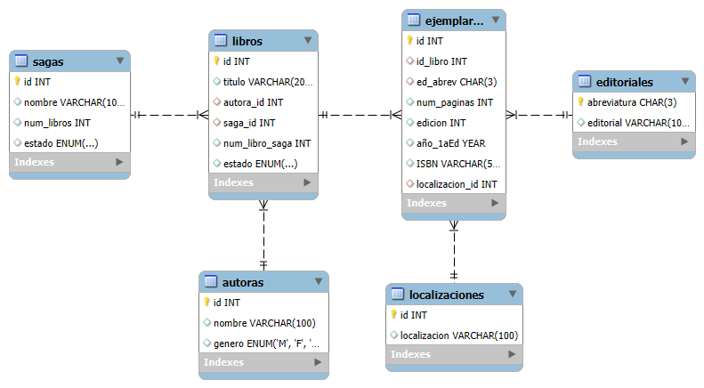

# Mi Bliblioteca

Este proyecto consiste en el diseño y la implementación de una base de datos para la gestión de una biblioteca a pequeña escala.

## :bookmark_tabs: Descripción del Proyecto

El objetivo principal es estructurar una base de datos donde poder almacenar y acceder a la información sobre los libros de la biblioteca.

## 🛠️ Tecnologías Utilizadas

- Sistema de gestión de bases de datos: MySQL 
- Lenguaje de modelado: SQL
- Herramientas adicionales MySQL Workbench

## :bar_chart: Modelo Entidad-Relacion

## :file_folder: Scripts Incluidos

- `CreacionBaseDatosMiBiblioteca.sql`: Contiene las sentencias para la creación de la BD y sus tablas.
- `DatosMiBiblioteca.sql`: contiene datos de prueba para la BD.
- `ProcedimientosFuncioneYTriggersMiBiblioteca.sql`: contiene los posibles *Procedimientos*, *Funciones* y *Triggers* útiles en la BD.

## :woman: Autor
**Uxía RD** - [GitHub](https://github.com/UxiaRD)